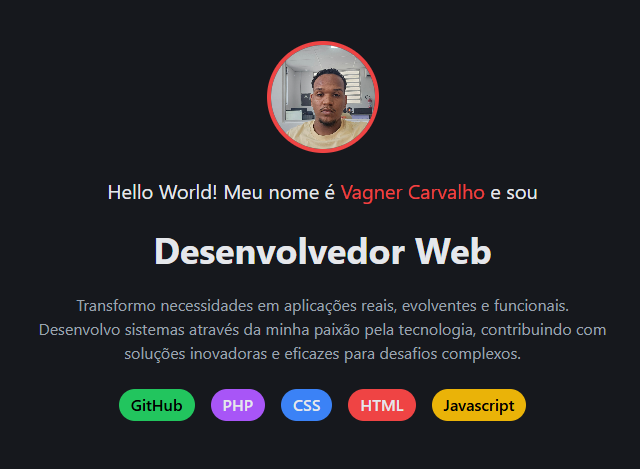

# Meu Portfólio Pessoal 🌟

Bem-vindo ao repositório do meu portfólio pessoal! Este projeto foi desenvolvido utilizando **PHP** e **Tailwind CSS**, com inspiração e suporte do curso de PHP da [Rocketseat](https://rocketseat.com.br/). 


---

## ✨ Tecnologias Utilizadas

- **PHP**: Back-end dinâmico e robusto.
- **Tailwind CSS**: Estilização moderna e responsiva.
- **HTML5**: Estrutura semântica.

---

## 🔍 Funcionalidades

- Apresentação das minhas habilidades e projetos.
- Design responsivo, garantindo uma boa experiência em dispositivos móveis e desktops.
- Estrutura simples e fácil de navegar.

---

## 🚀 Como Executar

1. Clone este repositório:
   ```bash
   git clone https://github.com/VagnerCode/PortFolio
   ```
2. Certifique-se de ter o PHP instalado.
3. No terminal, navegue até o diretório do projeto e inicie o servidor embutido:
   ```bash
   php -S localhost:8000
   ```
4. Abra o navegador e acesse `http://localhost:8000`.

---

## 🖼️ Prévia do Projeto

<div align="center">
  
</div>

---

## 🤝 Agradecimentos

Agradeço à [Rocketseat](https://rocketseat.com.br/) pelo excelente curso de PHP que serviu como base para o desenvolvimento deste projeto.
